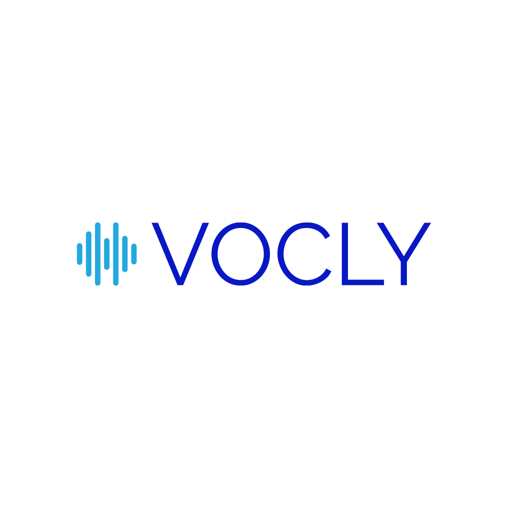

<!--  -->

    

Tired of endless clicking and typing? There's a better way to interact with your devices - through the power of your own voice! Introducing Vocly, the revolutionary app that allows you to control your computer completely hands-free using natural speech. 

Just talk naturally and Vocly will understand your requests and take actions for you. Want to open a website? Just say "Open example.com". Need to write an email? Dictate your entire message out loud. Vocly can follow commands, fill out forms, draft documents, and automate computer tasks through the magic of speech recognition.

Why struggle with memorizing keyboard shortcuts or clicking through menus? Take back your time and boost your productivity by speaking to your computer instead. Vocly brings you effortless voice control for work, creativity, and efficiency. The future is here - interact with your devices quickly, conveniently, and intuitively using your voice with Vocly. Start accomplishing more each day simply by speaking. The power of your voice is now in your hands!

Give Vocly a try and transform how you interface with your digital world. Voice control is the new way forward.